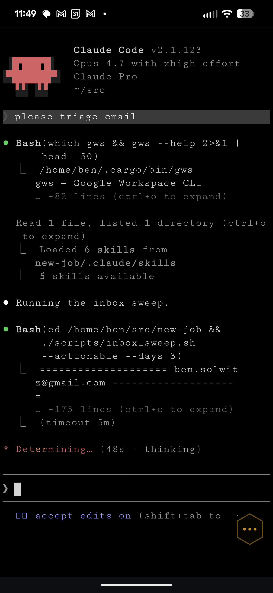
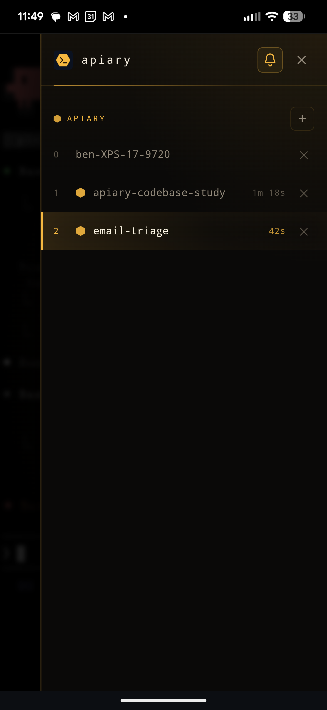

# Apiary

[](https://github.com/GetsEclectic/apiary/actions/workflows/test.yml)

Access your home machine's terminal — and the agentic CLIs running in it — from your phone, over mTLS.

<p align="center">
  
  
</p>

Apiary is a thin stack: `ttyd` serving a [wterm](https://github.com/vercel-labs/wterm)-based phone-optimized UI, backed by a long-lived `tmux` session that outlives the browser tab. Think of it as a keeper for a collection of agents (Claude Code, Codex, aider, whatever you run) that keep working while you're away from your desk.

## What you get

- A phone-first web terminal on your LAN at `https://<your-host>:3443/`.
- A persistent tmux session whose windows survive disconnects.
- A floating window-switcher drawer tuned for one-thumb operation.
- mTLS auth (self-signed CA, per-device client certs). No passwords.

## Requirements

- Linux (systemd user units) or macOS (launchd LaunchDaemons).
- `ttyd`, `tmux`, `node` (for the UI build), `openssl`, `python3`, `envsubst`.
- A LAN you trust end-to-end. This is not for exposure to the public internet.

## Install

```bash
git clone https://github.com/GetsEclectic/apiary.git ~/src/apiary
cd ~/src/apiary
./install.sh
```

`install.sh` detects your OS and:

1. Builds the UI (`npm ci && npm run build`).
2. Generates a CA, server cert, client cert, and a `<user>-client.p12` bundle in `~/.config/apiary/` if they don't exist.
3. Renders service definitions with paths templated to your `$HOME`:
   - **Linux**: three systemd user units into `~/.config/systemd/user/`, enabled with `systemctl --user`.
   - **macOS**: three launchd LaunchAgents into `~/Library/LaunchAgents/`, bootstrapped via `launchctl bootstrap gui/<uid>`. Agents — not LaunchDaemons — so each service inherits your login security session and can reach the macOS keychain (Claude Code's `/login` writes there). Trade-off: services start at GUI login, not at boot. If a previous install left `com.apiary.*` plists in `/Library/LaunchDaemons/`, `install.sh` will sudo-clean them as a one-time migration.
4. Prints the URL to visit from your phone.

### Getting the certs onto your phone

Two files live in `~/.config/apiary/` after install:

- `ca.crt` — the root CA your phone needs to trust.
- `<user>-client.p12` — your personal client cert, default password `apiary` (override with `P12_PASS=...` when running `gen-certs.sh`, or change it later with `openssl pkcs12`).

Copy both to the phone — `scp`, AirDrop, a password-manager shared vault, or a one-shot `python3 -m http.server` on loopback all work. The client cert's private key is inside the `.p12`, so treat it like any other credential.

**iOS.** Open each file in Safari or Files; iOS prompts to install a profile. Then:
- *ca.crt*: Settings → General → VPN & Device Management → tap the profile → Install. Then Settings → General → About → Certificate Trust Settings → toggle "Full trust" for the CA.
- *.p12*: Settings → General → VPN & Device Management → Install → enter the P12 password.

**Android.** Settings → Security & privacy → More security settings → Encryption & credentials → Install a certificate:
- *ca.crt*: "CA certificate" → accept the warning.
- *.p12*: "VPN & app user certificate" → pick the file → enter the P12 password.

Then visit `https://<host>:3443/` in Chrome/Safari. The browser will ask which client certificate to present; pick the one you just imported.

### macOS dependencies

```bash
brew install ttyd tmux gettext node python@3.12 jq bash
```

`gettext` provides `envsubst`; Homebrew doesn't link it by default, and `install.sh` resolves it via `brew --prefix gettext`.

### Recommended tmux config

wterm paints the whole viewport's background to match the bottom-right cell's bg color (so colored TUIs visually extend past the rendered grid). Tmux's stock `status-style` is `bg=green,fg=black`, which makes apiary look like a pea-green wash everywhere. Pick one in `~/.tmux.conf`:

```
set -g status off                         # hide status entirely
# or
set -g status-style bg=default,fg=white   # blend with the wterm default bg
```

Then `tmux source-file ~/.tmux.conf` to pick it up live, or `tmux kill-server` and let the launchd/systemd unit recreate the session.

## Uninstall

```bash
./uninstall.sh           # stop + remove services, keep certs in ~/.config/apiary/
./uninstall.sh --purge   # also delete the state dir
```

## Architecture

```
phone browser  ──mTLS──▶  tmux-api.py :3443 ─┬─▶  ttyd :3441 (loopback) ─▶  tmux "main"
                          (single mTLS      │       serves wterm UI (index.html)
                          termination)      │
                                            └─  local routes: /windows, /scrollback,
                                                /new-window, /activate, /kill, /push/*
```

`tmux-api.py` terminates mTLS on `:3443` and is the only service exposed on the LAN. It handles window-management, scrollback capture, and web-push itself, and reverse-proxies everything else (WebSocket upgrades included) to `ttyd` on loopback `:3441`. The UI speaks ttyd's WebSocket protocol directly rather than running xterm.js in the browser.

## Agent support

Terminal-level, Apiary is agent-agnostic — anything that runs in a shell (Claude Code, Codex, aider, plain `ssh`) works out of the box, and tmux gives each one its own persistent window.

Two integrations are currently Claude-Code-specific, not generic:

- **Push notifications** fire from `hooks/agent-finished.sh`, a Claude Code `Stop`-hook that reads Claude's transcript format. Codex / aider would each need a similar adapter against their own hook conventions.
- **Image paste** (browser → `/upload` → `@path` injected into the TTY) uses Claude Code's attachment syntax. Other agents have their own mechanisms.

Adapters for Codex and aider are welcome — open an issue or PR.

## Letting agents see your phone (Android)

If you want an agent running in the apiary session to see what's on your phone screen — UI under test, a rendered page, a weird dialog you're asking about — pair the phone with the home machine once via Android 11+ Wireless Debugging (Settings → System → Developer options → Wireless debugging → Pair device with pairing code). `adb` on most distros ships with mDNS support, so the device auto-reconnects whenever Wireless Debugging is on, and the agent can grab frames with `adb exec-out screencap -p > file.png` from any session without a reconnect step.

## Status

Linux (systemd user units) is what gets used daily and is what CI exercises. The macOS (launchd) path is implemented end-to-end in `install.sh` but isn't under continuous test coverage — reports welcome.

## License

MIT — see [LICENSE](LICENSE).

## Credits

Built on [ttyd](https://github.com/tsl0922/ttyd), [wterm](https://github.com/vercel-labs/wterm), and [tmux](https://github.com/tmux/tmux).
